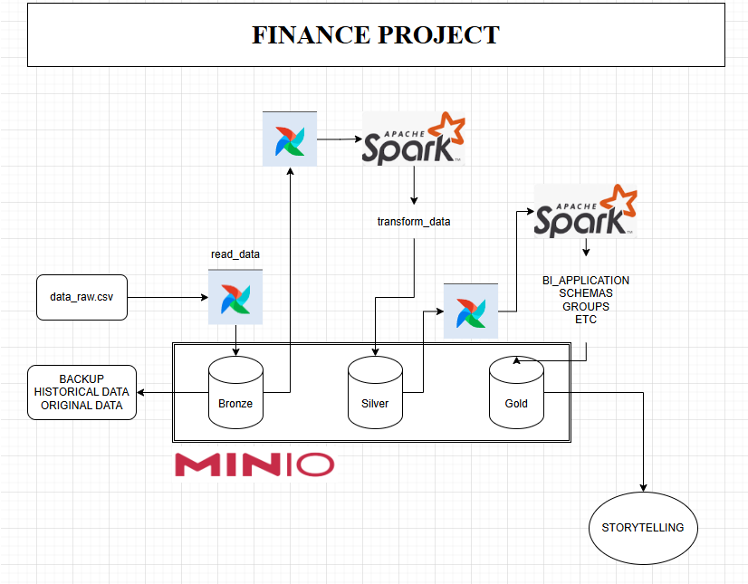

Overview
========

Esse projeto tem como objetivo aplicar e materializar conceitos de engenharia de dados, tais como: orquestração com airflow, armazenamento distribuído com MinIO e processamento
distribuído com Spark.
Fica claro que o objetivo aqui é totalmente voltado ao estudo, como forma de aprimoramento dos conceitos e aplicações no mundo real.

O projeto foi desenvolvido baseado no Astro CLI.

A estrutura do projeto está divida em: 
1. Ler um arquivo CSV de finanças e guardar em sua forma bruta na camada bronze.

2. Ler o arquivo CSV da camada bronze aplicar técnicas de tratamento de dados e salvar na camada prata em formato parquet.

3. Ler o arquivo CSV da camada prata e aplicar regras de negócios para visualização, storytelling, agrupamentos, etc.

O projeto está sendo construído da seguinte forma: 

# enginner_projetct_airflow
